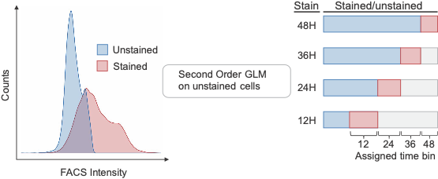
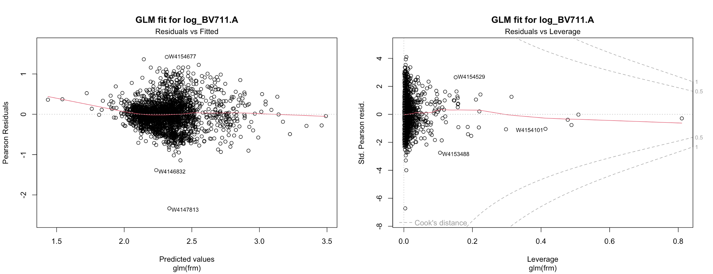
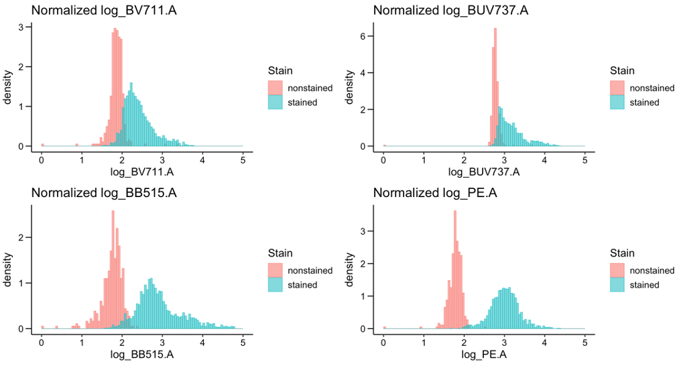
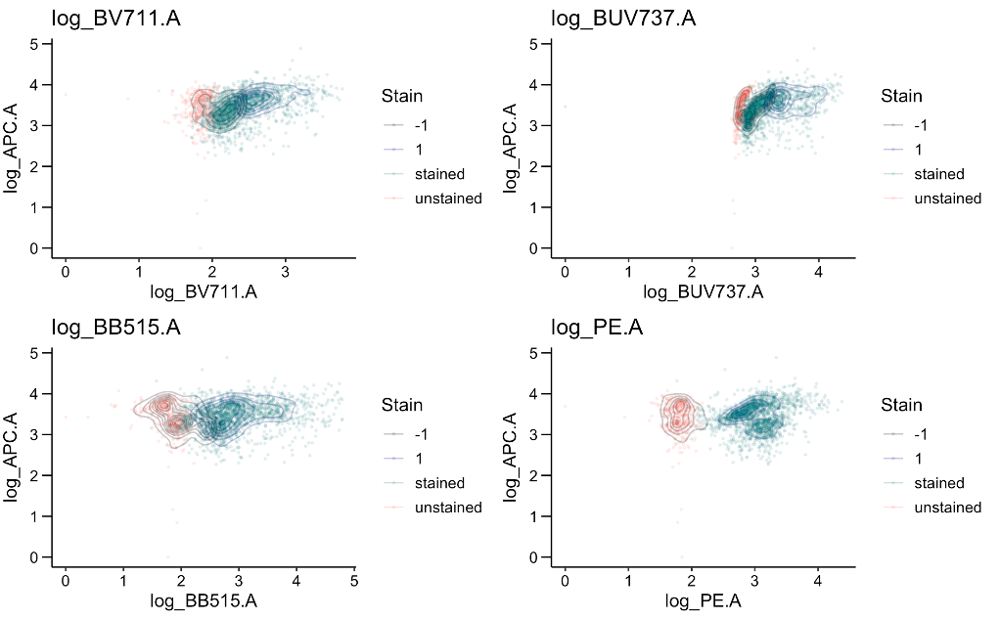
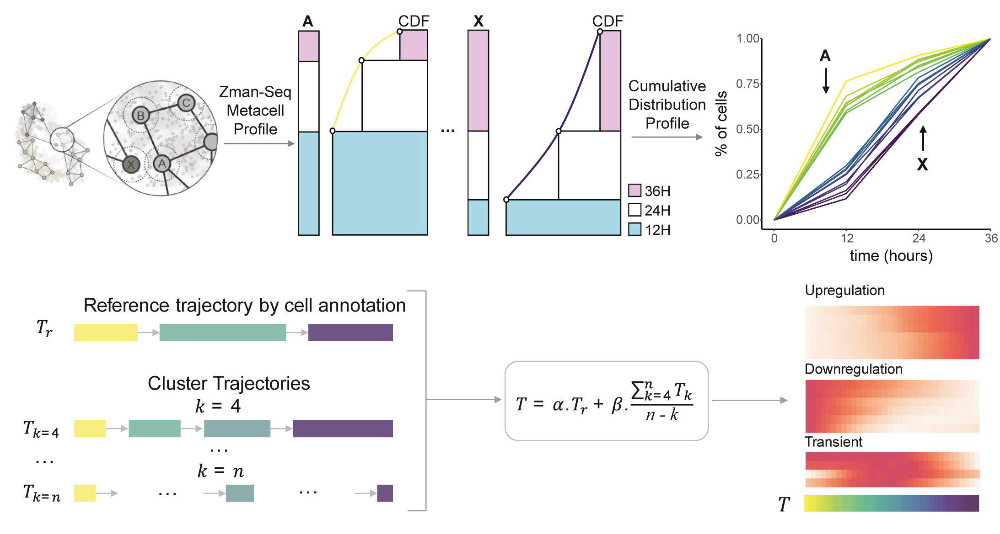
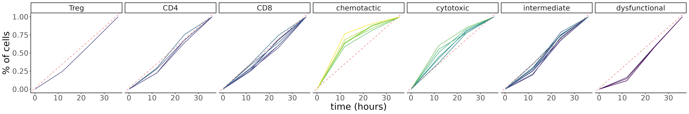
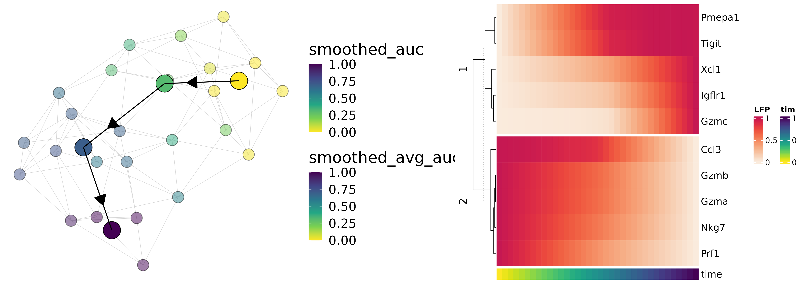

    

ZmanR is an R package for the assignment of time labels for temporally-resolved single-cell sequencing (Zman-seq - זמן). We utilized plate-based MARS-seq and FACS sorting to reveal the temporal dynamics of immune cells by measuring the time that immune cells enter the tumor. We also developed novel computational methods for time-informed trajectory analysis. 

 

Overview
========

The concept is to label all immune cells in the peripheral blood at different time points with different fluorescence markers and computationally determine the time bin that each immune cell belongs to. Since the cells could potentially obtain multiple time bins, we implement a generalized linear model on unstained cells to classify the stained cells for each individual fluorescence. Finally, we assign the time bin to a cell based on the 'most recent' time bin that the cell gets upon infiltration to the tumor. 

 

### Table of content
- [Installation](#Installation)
- [Example Usage](#example-usage)
    - [Preprocessing](#--Preprocessing)
    - [TimeAssignment](#--Time-Assignment)
    - [TrajectoryAnalysis](#--Trajectory-Analysis)
- [Citation](#citation-&-references)
- [Maintenance](#Maintenance)
### Installation
	git clone https://github.com/kenxie7/ZmanR
	R
	require(devtools)
	devtools::install("ZmanR")
### Preprocessing
We provide the example data for the peripheral and treatment data. The treatment data will be updated as example data soon.  
### Time Assignment

    library(ZmanR)
    # First we check whether the fluorescence signal is normal according to unstained cells when we fit a GLM model.
    # For now, the input is a cell metadata dataframe with log-transformed fluorescence data as columns for each cell, we will update for using Seurat/sce object as input. 
    # This will output the Q-Q, fitted vs residual, etc plots for evaluation and setting the standard deviation parameter for timebin assignment.
    FACS_model_eval(well_fcs_mc_Blood,
    		    fluorophores = c("log_BV711.A", "log_BUV737.A", "log_BB515.A", "log_PE.A"))
    

    # Visualize the distribution of FACS fluorophore for unstained vs stained cells
    plot_FACS_histogram(well_fcs_mc_Blood, 
    			fluorophores = c("log_BV711.A", "log_BUV737.A", "log_BB515.A", "log_PE.A"))
    

    # Assign the timebin to cells, where sd_threshold corresponds to the standard deviation threshold for each fluorophore:
    well_fcs_mc_Blood = FACS_model(well_fcs_mc_Blood, sd_threshold = c(2.5, 1.5, 2.5, 2),
    				   fluorophores = c("log_BV711.A", "log_BUV737.A", "log_BB515.A", "log_PE.A"),
  				   timebins = c("12H", "24H", "36H", "48H"))

    # Evaluate the assigned timebin with stained and nonstained cells: plotting each timebin color with APC or other self-defined FACS channel.
    # The contour shows the actual classification by the GLM model
    plot_FACS_eval(well_fcs_mc_Blood, 
    		   fluorophores = c("log_BV711.A", "log_BUV737.A", "log_BB515.A", "log_PE.A"),
  		   timebins = c("12H", "24H", "36H", "48H"), y_axis = "log_APC.A")
    

### Trajectory Analysis
We use metacells to first unbiasedly assign cells to metacells and annotated the metacells by gene expression. Then using cells with the time label, we can derive the AUC time of each metacell and construct the Zman trajectory along time as shown schematically below.

    library(ZmanR)
    library(metacell)
    # We provide example data to the naive GBM T/NK data which we showed in Figure 3 of the paper.
    # GBM_T_mc_annotations contain two columns, "celltype" annotation for each metacell "mc_id" 
    # well_fcs_GBM_T_time contains the "groundtruth_group" for the assigned time bin
    scdb_init("ZmanR/mc_example")
    new_id = "T_clean"

    # Here select_mcs refer to selection of metacells which are relevant (i.e. we separate T cells from myeloids to provide separate trajectory analysis since the turnover time is different for the two lineages)
    # The timepoints are the injection time points (12h, 24h, and 36h in this case )
    mc_cdf <- compute_mc_cdf(new_id, well_fcs_GBM_T_time, select_mcs = 1:37, mc_annotations = GBM_T_mc_annotations, time_points = c("12H","24H","36H"), time_for_auc = c(0,12,24,36), 		Gate="CD45_high")
    options(repr.plot.width=21, repr.plot.height=3.5)
    
    # We first show that the raw calculated AUC indeed reflect the patterning in the different cell types and also about labeled time
    ggplot(mc_cdf$mc_auc_time,aes(x=time, y=cums, group=mc,color=auc)) + geom_line() +  
    scale_color_viridis_c() +facet_wrap(~factor(celltype, levels = c('Treg','CD4','CD8','chemotactic','cytotoxic','intermediate','dysfunctional')), ncol = 7)+
        #scale_color_manual(values = topo.colors(31)) + 
        theme(text = element_text(size = 20),legend.position = "none") + 
        ylab('% of cells') + xlab("time (hours)")+geom_abline(intercept =  0.01412,     slope= 0.02810   ,
                                                             color="red",linetype = "dashed", alpha = .5) 

    # Then we continue to construct a smoothed AUC for downstream analysis, here we select the NK celltypes for first re-normalizing the expression data:
    NK_mc_exprs = normalize_mc_exprs(new_id, mc_annotations=GBM_T_mc_annotations, mc_cdf$mc2d_auc_time, select_celltypes = c("chemotactic", "cytotoxic", "intermediate", 			"dysfunctional"))
    select_GO_mc <- get_GO_exp(NK_mc_exprs$select_exprs,gene_type = "gene_names", organism = "mouse", takelog=F)
    filtered_GO_mc <- filter_exp(select_GO_mc, dispersion_threshold=0.05, threads = 1)

    # Here, we use the celltype clustering as reference for the trajectory construction, hence the ref_k should be equal to the number of distinct annotations in the data
    NK_smoothed_res = smooth_zman_trajectory(filtered_GO_mc, NK_mc_exprs, ref_k = 4)

    # Using spearman correlation, we can calculate both the correlation and pvalue for each gene for its correlation change along smoothed AUC Zman time.
    nk_corr = calculate_corr_genes(new_id, NK_smoothed_res, "spearman")
    signif(nk_corr$correlation[match(c("Tigit","Xcl1","Pmepa1","Igflr1", "Gzmc"), names(nk_corr$correlation))],3)
    signif(nk_corr$pvalues[match(c("Tigit","Xcl1","Pmepa1","Igflr1", "Gzmc"), names(nk_corr$correlation))],3)
    #Tigit 0.628 Xcl1 0.802 Pmepa1 0.741 Igflr1 0.661 Gzmc0.544
    #Tigit 0.00101 Xcl1 3.29e-06 Pmepa1 2.24e-05 Igflr1 0.00032 Gzmc0.00499

    # We can then visualize the trajectory and the smoothed gene expression along time with the following functions
    traj_plot <- plot_smoothed_trajectory(NK_smoothed_res, mc_cdf)
    gene_plot <- plot_zman_genes_heatmap(NK_predicted_res, NK_smoothed_res, up_regulated_genes = c("Tigit","Xcl1","Pmepa1","Igflr1", "Gzmc"), down_regulated_genes = 				c("Ccl3","Prf1","Gzma", "Gzmb","Nkg7"), k = 2)
    options(repr.plot.width=14, repr.plot.height=5)
    ggarrange(traj_plot, ggplotify::as.ggplot(gene_plot), widths = c(8, 6))

### Citation & References

If you liked or used our work, please cite:
###### Kirschenbaum, D., Xie, K., Ingelfinger, F., Katzenelenbogen, Y., Abadie, K., Look, T., ... & Amit, I. (2023). Time-resolved single-cell transcriptomics defines immune trajectories in glioblastoma. Cell. https://doi.org/10.1016/j.cell.2023.11.032

### Maintenance

If there's any questions / problems regarding ZmanR, please feel free to contact Ken Xie - kk.xie419@gmail.com. Thank you!

